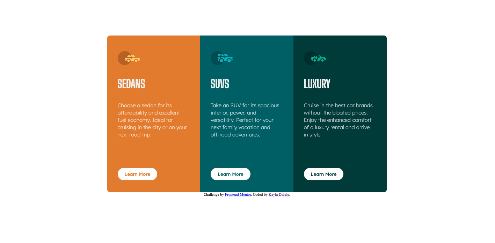

# Frontend Mentor - 3-column preview card component solution

This is a solution to the [3-column preview card component challenge on Frontend Mentor](https://www.frontendmentor.io/challenges/3column-preview-card-component-pH92eAR2-). Frontend Mentor challenges help you improve your coding skills by building realistic projects.

## Table of contents

- [Overview](#overview)
  - [The challenge](#the-challenge)
  - [Screenshot](#screenshot)
  - [Links](#links)
- [My process](#my-process)
  - [Built with](#built-with)
  - [Useful resources](#useful-resources)
- [Author](#author)

## Overview

### The challenge

Users should be able to:

- View the optimal layout depending on their device's screen size
- See hover states for interactive elements

### Screenshot

### Links

- Live Site URL: [https://kayladaigle.github.io/3-column-preview/]

## My process

### Built with

- Semantic HTML5 markup
- CSS custom properties
- Flexbox

### Useful resources

- https://stackoverflow.com/questions/1071927/how-can-i-force-overflow-hidden-to-not-use-up-my-padding-right-space
- https://dev.to/drews256/ridiculously-easy-row-and-column-layouts-with-flexbox-1k01
- https://stackoverflow.com/questions/56713111/make-flex-item-have-same-width-as-parent
- https://coryrylan.com/blog/how-to-center-in-css-with-flexbox

## Author

- Frontend Mentor - [@kayladaigle](https://www.frontendmentor.io/profile/kayladaigle)
